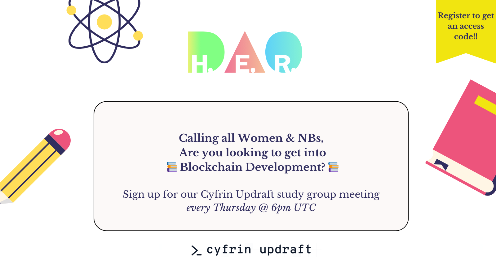

# Web3 Development Study Notes

We're an online study group of Women & NBs led by [H.E.R. DAO](https://www.her-dao.xyz/) members that is specifically focused on web3 development. the study material used in the course can all be found in [Cyfrin Updraft](https://updraft.cyfrin.io/) academy.

🗓️ Every Thursday @ 6pm UTC
 
📝 [Registration Form](https://airtable.com/appzC1CbYvkL1sV50/pagpZWB7CVZIJLuDj/form)

These are things that you can expect from our study group…

- Covering Cyfrin Updraft’s full courses from Blockchain Basics to Security and Auditing
- Writing smart contracts in Solidity and building DApps using Foundry
- Securing your smart contract and detecting vulnerabilities
- Exploring Blockchain applications (DEXs, NFT Marketplaces, …etc)
- Weekly assignments, building projects, and solving code challenges
- Learning with a community of developers. everyone will participate and present their findings

 
Happy Building! 🛠️

 

