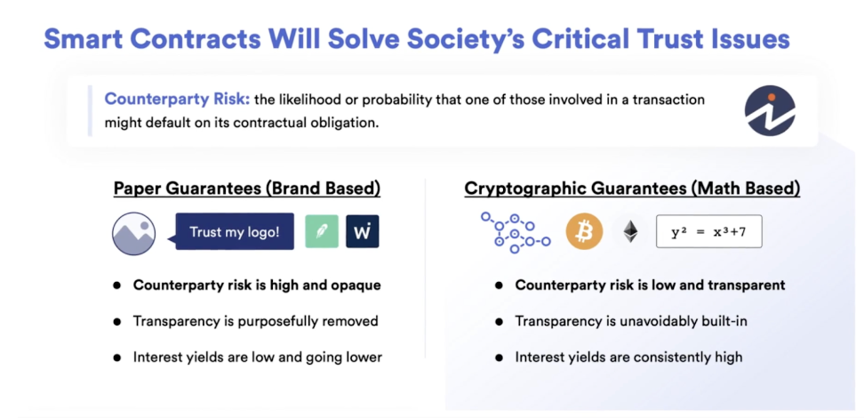

# Section 1: Blockchain Basics

_Feb 15, 2024_

## Lesson 2: What is a Blockchain?

- In 2008, a person named Satoshi Nakamoto released a whitepaper titled “Bitcoin: A Peer-to-Peer Electronic Cash System” [1]
- Bitcoin was one of the first protocols to implement the Blockchain technology
- Bitcoin is a network that is powered by cryptography and allowed people to engage in censorship resistant finance in a decentralized manner
- People considered Bitcoin as a “better” store of value (like Gold)
- In 2014, Vitalik Buterin published a whitepaper introducing Ethereum [2] that used the same blockchain infrastructure but with additional features (e.g. decentralized agreements also known as Smart Contracts)
- In 1994, Nick Szabo was the first to coin the term “Smart Contracts” [3]
- **Smart Contracts (Definition):** A set of instructions executed in a decentralized way without the need for a decentralized or 3rd party intermediary
- Technically Bitcoin & Ethereum both have smart contracts. However, Bitcoin’s smart contracts are intentionally **“turing incomplete”**, meaning they don’t have all the functionalities that a programming language would give them.

  - This is an intentional design in Bitcoin’s infrastructure because it is only meant to be a store of value rather than facilitating decentralized agreements

- **Oracle Problem (Definition):** the inability of blockchains to access external data, making them isolated networks, akin to a computer with no Internet connection. Bridging the connection between the blockchain (onchain) and the outside world (offchain) requires an additional piece of infrastructure—an oracle. [4]
- **Hybrid Smart Contracts (Definition):** smart contracts that combine code running on the blockchain (on-chain) with data and computation from outside the blockchain (off-chain) provided by decentralized oracle networks. [5]
- Most contracts are some type of hybrid contracts or interact with other hybrid smart contracts.
- Most blockchains are compatible with Ethereum type of smart contracts.
- DAPP stands for Decentralized Applications
- **The Web Evolution:**
  - **Web 1:** permissionless open sourced web with static content
  - **Web 2:** permissioned web, with dynamic content. where companies run your agreements on their servers.
  - **Web 3:** permissionless web, with dynamic content. Where decentralized censorship resistant networks run your agreement and code.

## Lesson 3: The purpose of smart contracts

- Smart contract (Definition): an agreement, contract, or a set of instructions that is deployed on a decentralized blockchain
- Smart contract features:
  - Cannot be altered (immutable) once deployed
  - Automatically executes
  - Everyone sees the terms of agreement
- Paper contracts vs. Smart contracts:
   
  

- Smart contracts value is represented by the concept of **Trust-minimized Agreement**. They’re minimizing the trust that we need to give other people in order for these agreements to be executed. [6]

## Lesson 4: Current smart contract landscape

- Additional smart contract features:
  - Decentralized (run by many node operators)
  - Transparency & flexibility (blockchain is pseudonymous so you still have privacy, it’s just that everyone can see the agreements being executed)
  - Speed & efficiency
  - Security & immutability
  - Counterparty risk removal
  - Trust-minimzed agreements
- Smart contract applications:

  - DeFi (Decentralized Finance)
  - DAOs (groups governed entirely by smart contracts)
  - NFTs (unique assets)

  ## Resources

  [1] [Bitcoin: A Peer-to-Peer Electronic Cash System.]  
  [2] [Ethereum: A Next-Generation Smart Contract and Decentralized Application Platform.
  By Vitalik Buterin (2014).](https://ethereum.org/content/whitepaper/whitepaper-pdf/Ethereum_Whitepaper_-_Buterin_2014.pdf)  
  [3] [The Idea of Smart Contracts](https://nakamotoinstitute.org/the-idea-of-smart-contracts/)  
  [4] [The Blockchain Oracle Problem](https://chain.link/education-hub/oracle-problem)  
  [5] [Hybrid Smart Contracts](https://chain.link/education-hub/hybrid-smart-contracts)  
  [6] [Trust-Minimized Applications: The New Standard](https://blog.chain.link/what-is-trust-minimization/)  
